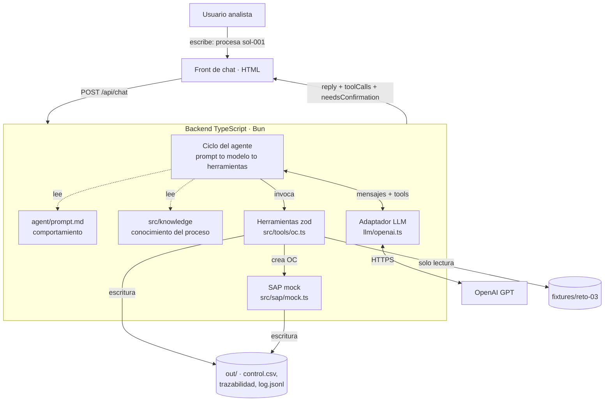
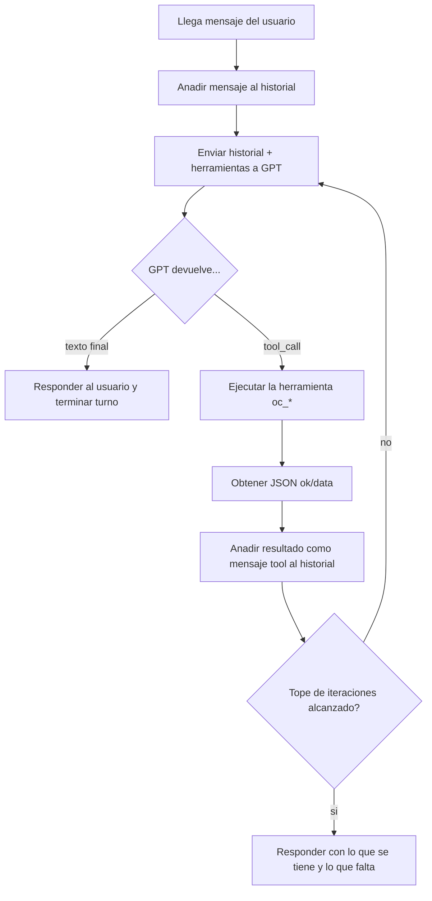

# Estrategia de solución — Reto 03 · Órdenes de Compra SAP

> Notas de contexto y diseño acordadas antes de escribir código.
> Perfil: data scientist (Python), sin experiencia previa en TypeScript ni producción.
> Restricción dura: 2 horas. Enfoque: spec-driven "lite" + reparto de trabajo.

---

## 1. Contexto y decisiones de la prueba

- **Reto elegido:** Reto 03 (Órdenes de Compra en SAP simulado). Es el más "lógico":
  las reglas RC1–RC10 son lógica sobre JSON ya normalizado — terreno natural para un data scientist.
- **Lenguaje:** TypeScript + Bun + `zod` (obligatorio por el PRD; Python NO está permitido en backend/herramientas).
- **Proveedor LLM:** OpenAI (GPT) para el ciclo del agente.
- **Enfoque:** Spec-driven "lite" — el `PRD.md` ya es la spec; añadimos una mini-spec de 1 página
  (contrato de herramientas + tabla RC1–RC10 + trazabilidad) que además es entregable en `SOLUCION.md`.

### Prioridades (líneas de corte si falta tiempo)
1. **Máxima prioridad:** herramientas `oc_*` + `demo.ts` corriendo determinista. Es el núcleo evaluado y NO necesita clave LLM.
2. Si falta tiempo: front y link se documentan como "correr en local" (penalización −10, pero sobrevive).
3. **NO se hace:** Excel/PDF real, adaptador SAP real (solo se diseña en texto), OCR.

---

## 2. Arquitectura de la solución

### Qué hace cada bloque

| Bloque | Responsabilidad | Dónde vive |
|---|---|---|
| **Front de chat** | Caja de texto + historial. Muestra cada llamada a herramienta (nombre, args, resultado) y resalta cuando el agente **pide confirmación**. HTML plano basta. | `web/` |
| **Backend / server** | Expone `/api/chat`. Recibe el mensaje, ejecuta el **ciclo del agente**, devuelve la respuesta. Sesión en memoria. | `src/server.ts` |
| **Ciclo del agente** | El bucle: manda historial + herramientas al modelo → si pide herramienta, la ejecuta → le devuelve el resultado → repite hasta responder en texto o tope de iteraciones. | dentro de `server.ts` |
| **Adaptador LLM** | Traduce entre el ciclo y OpenAI. Interfaz `enviar(mensajes, herramientas) → respuesta`. Cambiar de proveedor solo toca este archivo. | `src/llm/openai.ts` |
| **Herramientas (`oc_*`)** | **Única fuente de datos verídicos.** Leen fixtures, aplican RC1–RC10, construyen payload, crean OC. Cada una devuelve `{ ok, data }` y **nunca lanza**. | `src/tools/oc.ts` |
| **SAP mock** | Simula SAP: asigna números `4500000001+`, guarda en `out/sap/ordenes.jsonl`, garantiza idempotencia. | `src/sap/mock.ts` |
| **Prompt / Conocimiento** | **Comportamiento** en `agent/prompt.md`; **conocimiento del proceso** en `src/knowledge/`. Separados del código a propósito. | archivos aparte |
| **fixtures / out** | `fixtures/` = entrada de solo lectura. `out/` = todo lo generado. | carpetas |

### Flujo de datos, paso a paso (caso `sol-001`)
1. Usuario escribe: "procesa la solicitud sol-001".
2. Front hace `POST /api/chat` con el mensaje.
3. El ciclo manda al GPT el mensaje + las herramientas disponibles.
4. GPT responde: "quiero llamar `oc_leer_paquete` con `{caso:'sol-001'}`".
5. El backend ejecuta la herramienta (lee fixtures) → devuelve JSON `{ ok, data }`.
6. El resultado vuelve a GPT, que pide `oc_validar`, luego `oc_construir_payload`...
7. Si hay una confirmación pendiente, el agente **corta el turno** y pregunta. No crea la OC hasta que el usuario responda "sí".
8. Cuando todo está `apta`, llama `oc_crear` → el SAP mock devuelve `numero_oc`.
9. El backend devuelve la respuesta final + la lista de tool calls; el front las muestra.

**Idea central:** GPT decide *qué* hacer y *en qué orden*, pero **los valores siempre salen de las herramientas**, nunca los inventa el modelo. Por eso `demo.ts` corre **sin GPT**.

---

## 3. El ciclo del agente en profundidad

### La idea
Un LLM normal recibe texto y devuelve texto. Un **agente** es un LLM con **herramientas** metido en un **bucle**:
el modelo puede pedir "ejecuta esta herramienta", tú la ejecutas, le devuelves el resultado, y repites
**varias veces** hasta que tiene todo para responder. El "ciclo del agente" es ese bucle.

### Por qué un bucle y no una sola llamada
Procesar `sol-001` requiere pasos encadenados donde cada uno depende del anterior:
leer → validar → construir → crear. El modelo descubre los datos llamando herramientas; necesita ver
el resultado de `oc_leer_paquete` antes de decidir el siguiente paso.

### Las piezas del protocolo (cómo habla OpenAI con las herramientas)
La conversación es una **lista de mensajes** con roles:

| Rol | Qué es | Ejemplo |
|---|---|---|
| `system` | Instrucciones fijas del agente (`agent/prompt.md`) | "Eres un asistente que crea OC. Nunca inventes valores. Pide confirmación antes de crear si hay excepciones." |
| `user` | Lo que escribe la analista | "procesa sol-001" |
| `assistant` | Respuesta del modelo: texto o una petición de herramienta (`tool_call`) | "quiero llamar `oc_leer_paquete({caso:'sol-001'})`" |
| `tool` | El resultado que devuelves tras ejecutar la herramienta | `{ ok:true, data:{ solicitud:{...} } }` |

Además de los mensajes, a OpenAI le pasas la **lista de herramientas** (nombre, descripción, esquema de args derivado de `zod`). El modelo lee las descripciones y decide cuál pedir.

### El bucle, paso a paso

1. Metes el mensaje del usuario en el historial.
2. **Llamas a GPT** con todo el historial + herramientas.
3. GPT responde:
   - **Texto** → respuesta final, terminas el turno.
   - **`tool_call`** → ejecutas cada herramienta, metes el resultado como mensaje `tool`, y vuelves al paso 2.
4. Un contador impide bucles infinitos: **tope de ~25 iteraciones** (CA1). Si se alcanza, respondes con lo que haya.

Es literalmente un `while` con un contador.

### Los dos guardarraíles que evalúan

**1. El modelo no puede inventar valores (CA2).**
Los datos de una OC (proveedor, valor, IVA) nunca salen del modelo; salen de las herramientas.
El modelo solo orquesta. Garantizado por: (a) el system prompt lo prohíbe, (b) el diseño lo hace innecesario.
Por eso `demo.ts` prueba toda la lógica sin GPT.

**2. Confirmación humana (CA3) — lo más sutil.**
Algunas acciones no se ejecutan de una. Ej. `sol-006` (IVA no informado → RC6, confirmación):
- `oc_validar` devuelve `confirmaciones: ["IVA derivado del proveedor: C1"]`.
- El agente **NO llama `oc_crear`**. Corta el turno y pregunta: "El IVA no venía; lo derivé como C1. ¿Confirmo y creo la OC?"
- El front resalta ese estado (`needsConfirmation: true`).
- El usuario responde "sí" en un **mensaje nuevo**.
- Solo entonces el agente llama `oc_crear` con `confirmado: true`.

Regla dura: `oc_crear` solo ejecuta si `apta = true` y (`confirmaciones` vacío **o** `confirmado = true`).
El doble candado —en la herramienta Y en el flujo— es lo que evalúan.

### Mapeo a los 6 casos

| Caso | Qué provoca en el ciclo |
|---|---|
| `sol-001` | Feliz: leer → validar (apta) → construir → crear. OC directo. |
| `sol-002` | **Bloqueo** (proveedor inexistente). No crea, explica. |
| `sol-003` | **Bloqueo** (aprobador sin autoridad). No crea. |
| `sol-004` | **Confirmación** (cotización ≠ solicitud). Corta, pregunta, espera "sí", crea. |
| `sol-005` | **Confirmación** + `retroactiva=true` (factura anterior). Crea tras confirmar, registra en control. |
| `sol-006` | **Confirmación** (IVA no informado, derivado). Igual que 004. |

**Bloqueo** = nunca crea. **Confirmación** = crea solo con segundo mensaje. Esa distinción es el núcleo.

### Topes (control de costo, RNF)
- **Tope de iteraciones por turno** (~25): evita bucles infinitos de tool calls.
- **Tope de tokens por sesión** (configurable): evita que alguien gaste la clave de OpenAI sin límite.

### Resumen mental
El ciclo del agente es un `while` que: (1) pregunta al modelo qué hacer, (2) si pide herramienta la ejecuta
y le devuelve el resultado, (3) repite hasta responder en texto o tocar el tope, (4) se detiene a pedir
confirmación cuando una herramienta señala una excepción.
El modelo decide el *orden*; las herramientas dan los *datos*; el humano da el *permiso*.
